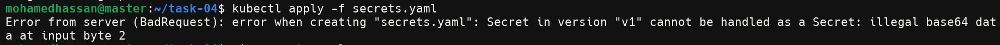
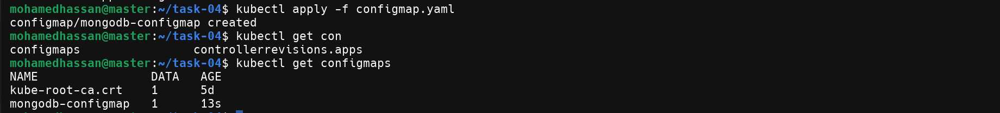
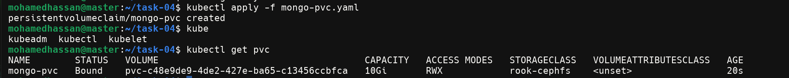
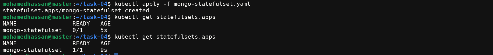
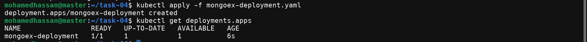
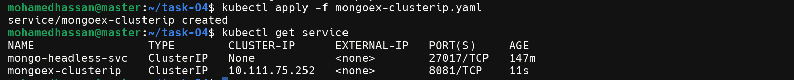
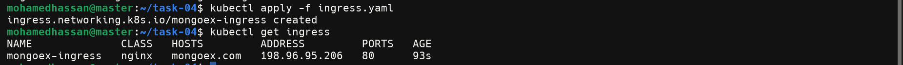
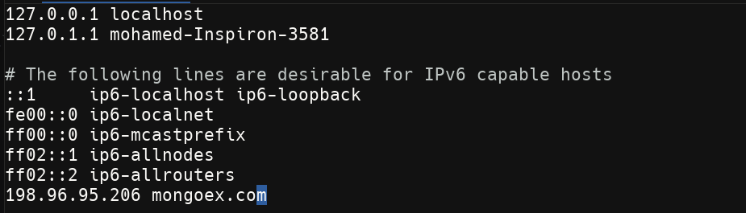
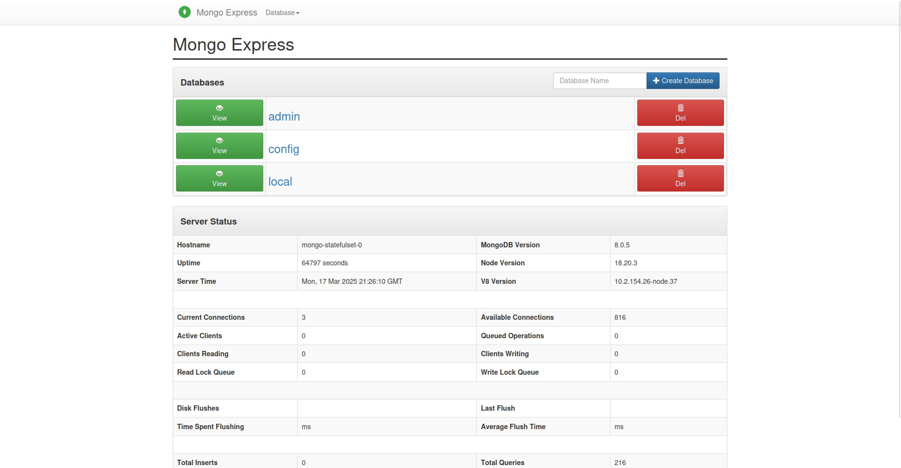

# MongoDB with Mongo-Express on Kubernetes

## Overview
This project sets up a MongoDB database along with Mongo-Express as a web-based MongoDB administration interface, deploying them onto a Kubernetes cluster.

## Features
- Deploys MongoDB using a **StatefulSet** for persistent storage.
- Deploys Mongo-Express using a **Deployment** for web-based database administration.
- Uses a **ConfigMap** for managing configuration values.
- Uses **Secrets** for storing sensitive credentials securely.
- Creates **Persistent Volume Claims (PVCs)** for database storage.
- Exposes services through **ClusterIP** and **Ingress**.

## Prerequisites
Ensure you have the following installed:
- **Kubernetes Cluster** (Minikube, AKS, GKE, EKS, etc.)
- **kubectl CLI tool**
- **Ingress Controller** (e.g., Nginx Ingress Controller)

---

## Deployment Guide
### 1. Create Namespace (Optional)
To organize resources within Kubernetes, create a namespace:
```sh
kubectl create namespace mongo-express
kubectl config set-context --current --namespace=mongo-express
```

### 2. Create Secrets
Store MongoDB credentials securely using Kubernetes Secrets. Apply the following YAML:
```yaml
apiVersion: v1
kind: Secret
metadata:
  name: mongodb-secret
type: Opaque
data:
  mongo-root-username: YWRtaW4=
  mongo-root-password: cGFzc3dvcmQ=
```
Apply it:
```sh
kubectl apply -f secrets.yaml
```
<div align="center">
  
</div>
Don't forget to encrypt the root username and password first
<div align="center">
  
</div>

<div align="center">
  
</div>
### 3. Configure MongoDB
Define MongoDB configurations using a ConfigMap:
```yaml
apiVersion: v1
kind: ConfigMap
metadata:
  name: mongodb-configmap
data:
  database_url: "mongodb://mongo-headless-svc:27017"
```
Apply it:
```sh
kubectl apply -f configmap.yaml
```
<div align="center">
  
</div>

### 4. Set Up Persistent Storage
Define storage for MongoDB:
```yaml
apiVersion: v1
kind: PersistentVolumeClaim
metadata:
  name: mongo-pvc
spec:
  storageClassName: rook-cephfs
  accessModes:
    - ReadWriteMany
  resources:
    requests:
      storage: 10Gi
```
Apply it:
```sh
kubectl apply -f mongo-pvc.yaml
```
<div align="center">
  
</div>

### 5. Deploy MongoDB
Create a StatefulSet for MongoDB:
```yaml
apiVersion: apps/v1
kind: StatefulSet
metadata:
  name: mongo-statefulset
spec:
  serviceName: "mongo-headless-svc"
  replicas: 1
  selector:
    matchLabels:
      app: mongo-pod
  template:
    metadata:
      labels:
        app: mongo-pod
    spec:
      containers:
      - name: mongo
        image: mongo:latest
        ports:
        - containerPort: 27017
        env:
        - name: ME_CONFIG_MONGODB_ADMINUSERNAME
          valueFrom:
            secretKeyRef:
              name: mongodb-secret
              key: mongo-root-username
        - name: ME_CONFIG_MONGODB_ADMINPASSWORD
          valueFrom:
            secretKeyRef:
              name: mongodb-secret
              key: mongo-root-password
```
Apply it:
```sh
kubectl apply -f mongo-statefulset.yaml
```
<div align="center">
  
</div>

### 6. Create MongoDB Services
Define a headless service for MongoDB:
```yaml
apiVersion: v1
kind: Service
metadata:
  name: mongo-headless-svc
spec:
  clusterIP: None
  selector:
    app: mongo-pod
  ports:
    - name: mongo-port
      port: 27017
      targetPort: 27017
```
Apply it:
```sh
kubectl apply -f mongo-headless-svc.yaml
```
<div align="center">
  
</div>

### 7. Deploy Mongo-Express
Create the Mongo-Express deployment:
```yaml
apiVersion: apps/v1
kind: Deployment
metadata:
  name: mongoex-deployment
spec:
  replicas: 1
  selector:
    matchLabels:
      app: mongoex-deployment
  template:
    metadata:
      labels:
        app: mongoex-deployment
    spec:
      containers:
      - name: mongoex
        image: mongo-express
        ports:
          - containerPort: 8081
        env:
          - name: ME_CONFIG_MONGODB_ADMINUSERNAME
            valueFrom:
              secretKeyRef:
                name: mongodb-secret
                key: mongo-root-username
          - name: ME_CONFIG_MONGODB_ADMINPASSWORD
            valueFrom:
              secretKeyRef:
                name: mongodb-secret
                key: mongo-root-password
          - name: ME_CONFIG_MONGODB_URL
            valueFrom:
              configMapKeyRef:
                name: mongodb-configmap
                key: database_url
```
Apply it:
```sh
kubectl apply -f mongoex-deployment.yaml
```
<div align="center">
  
</div>

### 8. Expose Mongo-Express via ClusterIP
```yaml
apiVersion: v1
kind: Service
metadata:
  name: mongoex-clusterip
spec:
  selector:
    app: mongoex-deployment
  ports:
    - protocol: TCP
      port: 8081
      targetPort: 8081
```
Apply it:
```sh
kubectl apply -f mongoex-clusterip.yaml
```
<div align="center">
  
</div>

### 9. Set Up Ingress for External Access
```yaml
apiVersion: networking.k8s.io/v1
kind: Ingress
metadata:
  name: mongoex-ingress
  annotations:
    nginx.ingress.kubernetes.io/rewrite-target: /
spec:
  ingressClassName: nginx
  rules:
  - host: mongoex.com
    http:
      paths:
      - path: /
        pathType: Prefix
        backend:
          service:
            name: mongoex-clusterip
            port:
              number: 8081
```
Apply it:
```sh
kubectl apply -f ingress.yaml
```
<div align="center">
  
</div>

### 10. Verify Deployment
Check if everything is running:
```sh
kubectl get pods
kubectl get svc
kubectl get ingress
```

### 11. Update Hosts File (If Needed)
```sh
echo "<YOUR-CLUSTER-IP> mongoex.com" | sudo tee -a /etc/hosts
```
<div align="center">
  
</div>

### 12. Access Mongo-Express
Go to:
```
http://mongoex.com
```
<div align="center">
  
</div>

### 13. Cleanup Resources
To remove everything:
```sh
kubectl delete -f .
```

## Conclusion
By following these steps, you successfully deployed MongoDB with Mongo-Express on Kubernetes. 🎉 Happy coding!


